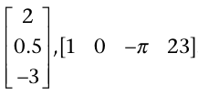
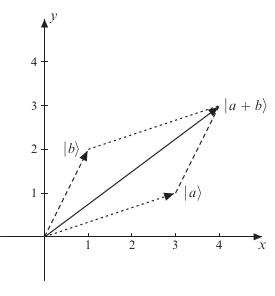

> Vectors:
* A vector is just a list of numbers. The dimension of the vector is the number
of numbers in the list.

* If the lists are written vertically, we call them column vectors or **kets**.

* If the lists are written horizontally, we call them row vectors or **bras**.

* The numbers that make up a vector are often called entries. To illustrate, here is a three-dimensional ket and a four-dimensional bra:

> Length of Vectors

* The length of a vector is, as might be expected, the distance from its initial point to its terminal point. This is the square root of the sum of squares of the entries.

> Scaler Multiplication

* We can multiply a vector by a number.

* We do this by multiplying each of the entries by the given number.

> Vector Addition

* Given two vectors that have the same type—they are both bras or both kets—and they have the same dimension, we can add them to get a new vector of the same type and dimension.

* The first entry of this vector just comes from adding the first entries of the two vectors, the second entry from adding the two second entries, and so on.

* Vector addition can be pictured by what is often called the parallelogram law for vector addition.

