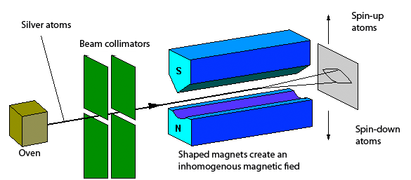

* A qubit can be represented by the spin of an electron or the polarization of a photon.
* In 1922, Niels Bohr’s planetary model described the current understanding of atoms. In this model an atom consisted of a positive nucleus orbited by negative electrons.
* Electrons moving in circular orbits generate magnetic fields. The electrons in the inner orbits are paired, each of the pair rotating in the opposite direction to its partner, resulting in their magnetic fields cancel-
ing. 
* However, the single electron in the outer orbit generates a magnetic field that is not canceled by other electrons.
* A foundational experiment was performed by Otto Stern and Walther Gerlach on the spin of silver atoms. Silver atoms (Ag, 47) have one electron in the outermost orbit.
* Stern and Gerlach designed an experiment to test whether the north–south axes of these magnets could have any direction whatsoever or whether they were constrained to certain directions.
* They did this by sending a beam of silver atoms through a pair of magnets as is depicted in the following figure:

* Observations:
    * The vee-shaped design of the magnet makes the south magnet act more strongly than the north.
    * When Stern and Gerlach looked at the screen, they found just two dots: one at the extreme top and the other at th extreme bottom. 
    * All of the atoms behaved like little bar magnets that were aligned vertically. None of them had any other orientation.
    * They concluded that that electrons are little magnets with their north and south poles perfectly aligned in the vertical direction. None of them have any other orientation.
    * This proved that *spin is quantized!!*
